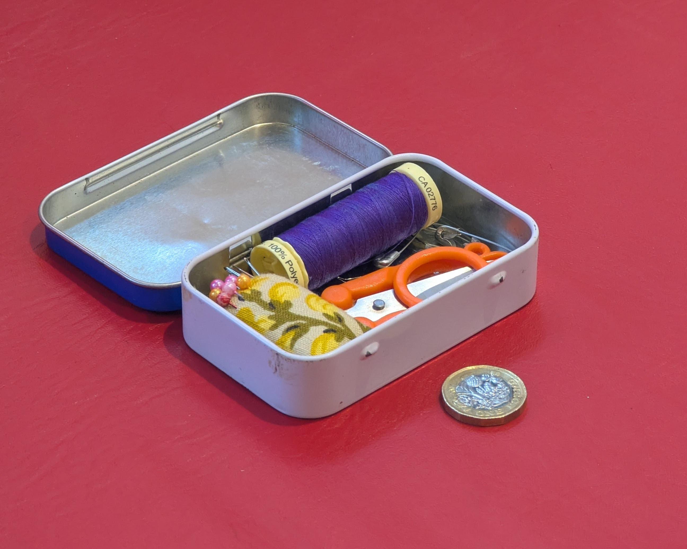
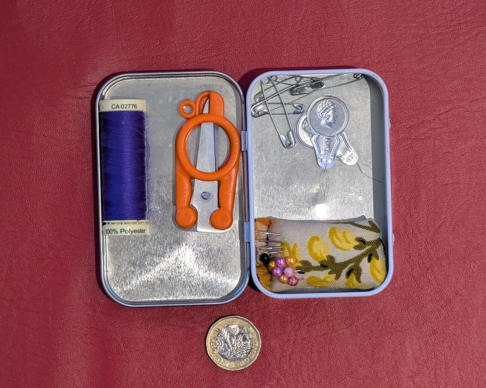
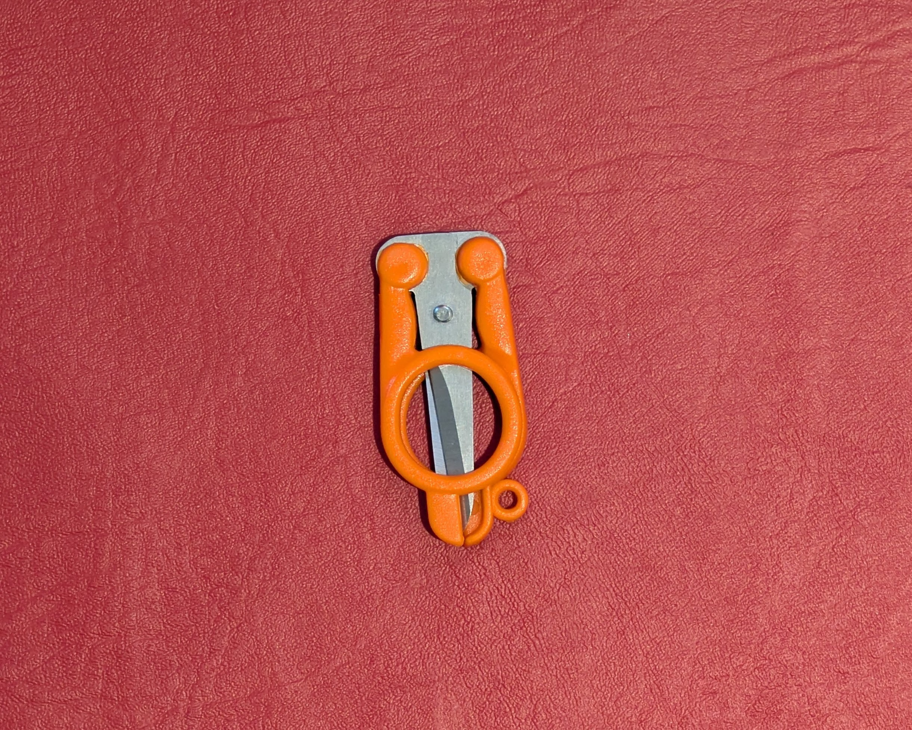
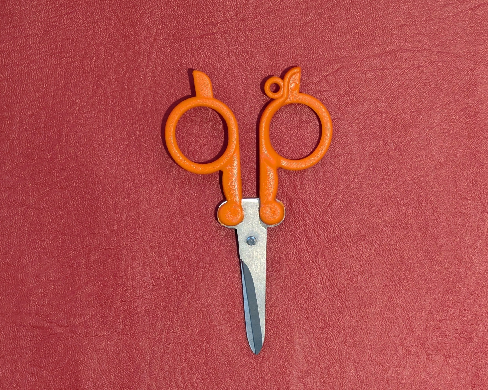
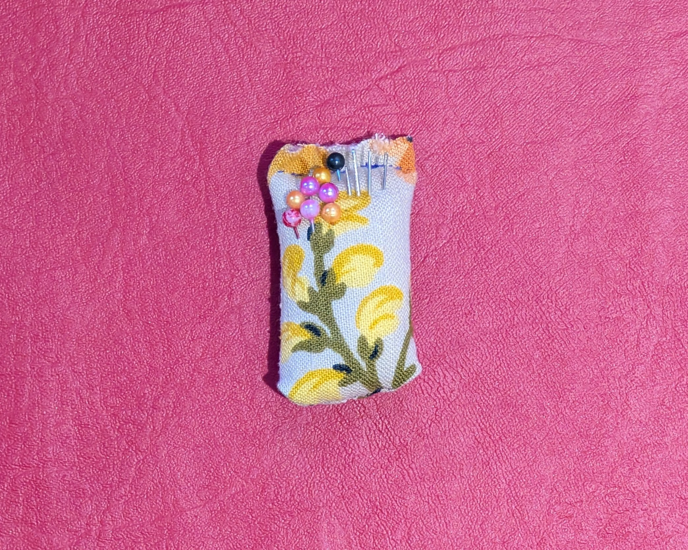
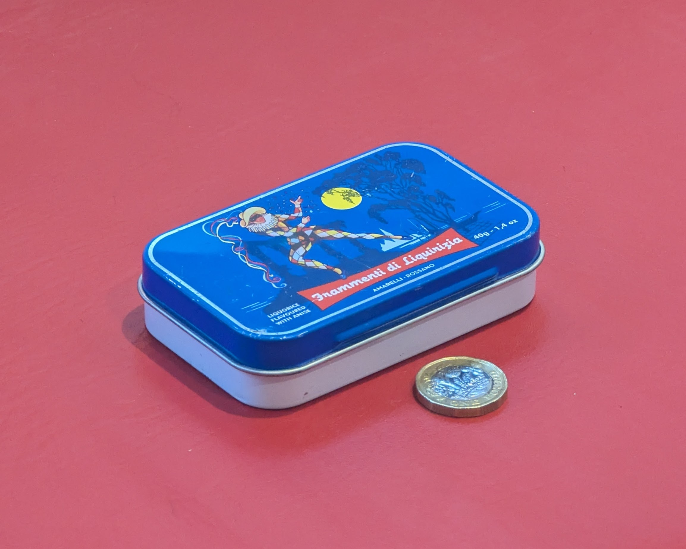

+++
date = "2026-08-02"
updated = "2026-08-02"
title = "alifeee's tiny sewing kit"
[taxonomies]
by = ["alifeee"]
[extra]
titleimage = "toolkits/alifeee_sewing_kit/kit_perspective_open_scale.jpg"
+++

## tiny sewing kit!

a little kit used for little things on the go: simple repairs; fixing buttons; adding patches.

## kit contains

- **scissors** — they fold! how cute ! they're also very sharp :] got them from my local haberdashery. they came with a larger set of scissors as a 2-pack. I think they're German.
- **thread** — why have black thread and white thread and colour-matched thread when you can just have favourite-colour thread
- **needle threaders** — I can't be expected to poke tiny thread through tiny whole while sat on large train, inside dark car, or on windy street
- **pincushion** — custom-made to fit in the box. all the spiky stuff would go everywhere otherwise!
- **needles** — pretty pivotal for sewing
- **pins** — don't really use these much but what's a pincushion without them
- **safety pins** — attach anything to anything else! on the go! fix a broken button! almost anything you can imagine*! (*that requires a safety pin)

### the scissors

| | folded | unfolded |
| --- | ------ | -------- |
| check out that folding action! |  |  |

### the pincushion

using some scrap fabric, tried to find a section which had a pattern roughly sized to be the front of the pincushion. stuffed. reminds me of a tiny sack of flour.

## closed

the tin is an old liquorice tin, and by old I mean I ate all the liquorice.

## happy sewing!

\- [alifeee](https://alifeee.net/)
